# Galagino ported to platformio - with 5 additional games

This repo is a port of Till Harbaum's awesome [Galaga emulator](https://github.com/harbaum/galagino) ported to platformio.
This port is NOT by the original author, so please do not bother him with issues.

This solution is an easy way to build a galagino arcade machine. No need of a 3D printer and PCB´s. Just buy the hardware listed below.

Demonstration video: [DIY ESP32 Project 2025: ESP32 Game - Multi Arcade Machine](https://www.youtube.com/watch?v=N-ntNdpjVxQ)

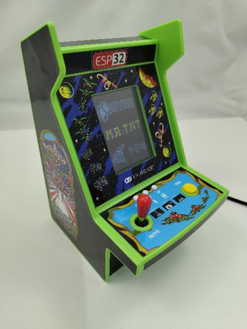

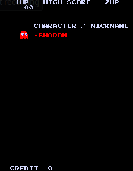
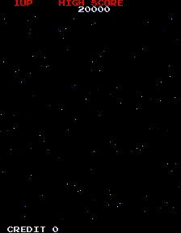
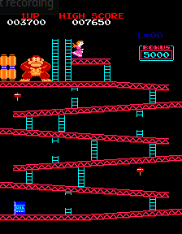
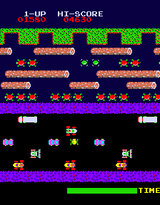
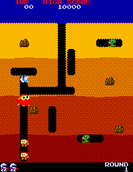
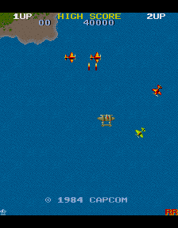
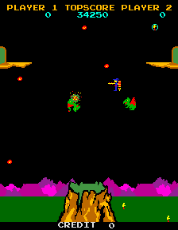
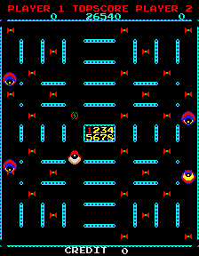
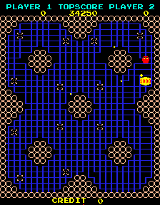
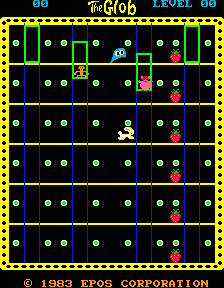
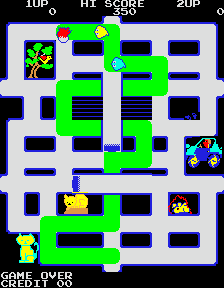

## Hardware

### Used hardware
*  Arcade machine [Arcade-Galaga-Micro-Player-Pro](https://www.amazon.com/Arcade-Galaga-Micro-Player-Pro-Collectible/dp/B0BT2ZJXGK?th=1)
    * IMPORTANT: Use an arcade machine with fire button and full joystick. PAC MAN machine does not have a fire button and SPACE INVADER do have a joystick with left/right only. The machine must have a 2.8" inch UPRIGHT display. There are cheaper models with a 2.4" inch display - that do not fit.

* Cheap yellow display [CYD](https://www.amazon.de/dp/B0D5H84RDB)
    * IMPORTANT: The CYD should have a speaker output. The CYD should be delivered with connection cables.
 
* 1kOhm resistor and a plug from a USB-C cable.

### Build hardware
These are the steps to build the new hardware for the machine:

* Stickers can’t stop us: To open the cabinet, remove some of the artwork stickers from the outside. Screws are hidden under the side artwork, and the top sticker crosses 
  a seam that will need to be separated. Using a heat gun or hair dryer. Soften the glue and peel back these stickers. They are fairly thick and easy to remove once you get a corner up.
  Keep them somewhere safe for reassembly. TIP: I left out the side screws when screwing it together again.

* Use a soldering iron to disconnect the main board from the external boards. The main board with display, we do not need that anymore.
	
* Use a soldering iron to connect the wires from the CYD. Connect them like in the schematics.
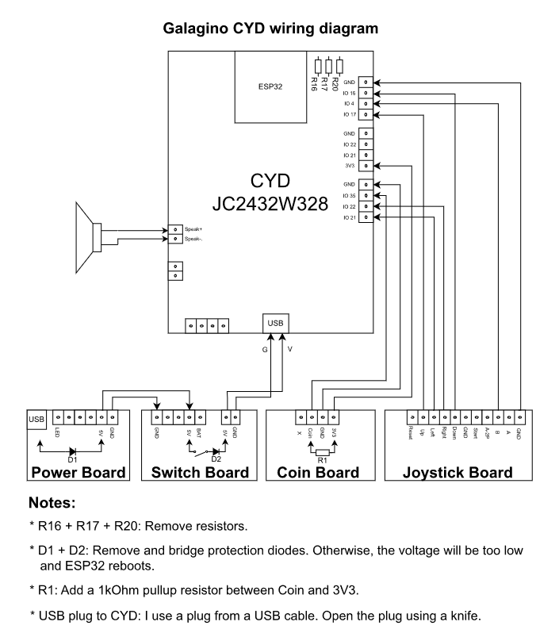

* Use cable ties and two srews to fix the CYD on the front of the cabinet - it fits perfectly.
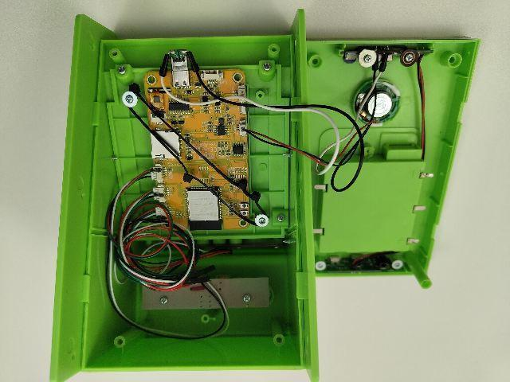

## Software

Like in the original from Till Harbaum's Galaga emulator, download these files:

* The [Galagino specific code](source/) contained in this repository
* A [Z80 software emulation](https://fms.komkon.org/EMUL8/Z80-081707.zip) by [Marat Fayzullin](https://fms.komkon.org/)
* The original ROM files
    * [Galaga (Namco Rev. B ROM)](https://www.google.com/search?q=galaga.zip+arcade+rom)
    * [Pac-Man (Midway)](https://www.google.com/search?q=pacman.zip+arcade+rom)
    * [Donkey Kong (US set 1)](https://www.google.com/search?q=dkong.zip+arcade+rom)
    * [Frogger](https://www.google.com/search?q=frogger.zip+arcade+rom)
    * [Digdug](https://www.google.com/search?q=digdug.zip+arcade+rom)
    * [1942](https://www.google.com/search?q=1942.zip+arcade+rom)
    * [Lizard Wizard](https://www.google.com/search?q=lizwiz.zip+arcade+rom)
    * [Eyes](https://www.google.com/search?q=eyes.zip+arcade+rom)
    * [Mr. TNT](https://www.google.com/search?q=mrtnt.zip+arcade+rom)
    * [The Glob](https://www.google.com/search?q=theglobp.zip+arcade+rom) (Important: filename with "p")
    * [Crush Roller](https://www.google.com/search?q=crush.zip+arcade+rom)

Galagino uses code that is not freely available and thus not included in this repository. Preparing the firmware thus consists of a few additional steps:

* If you do not have Python installed, download it from here. [Python 3.13.0](https://www.python.org/downloads/release/python-3130)
* The ROM ZIP files have to be placed in the [romszip directory](romszip/), together with the ZIP file containing the Z80 emulator.
* A set of [python scripts](romconv/) is then being used to convert and patch the ROM data and emulator code and to include the resulting code into the galagino machines directory. For all games, just use conv__all.bat.

The [ROM conversion](./romconv) create a whole bunch of additional files in the [source directory](./source). Please check the README in the [romconv](./romconv) directory for further instructions.
Please ensure that the stripts run without errors!

With all these files in place, the source folder can be loaded into visual studio code with the [PlatformIO](https://platformio.org/) plugin. The needed
platform packages and the arduino framework will be installed during compilation automatically.
For best performance, compile and upload the release version.

Like in the original:
If you want to use a LED stripe, you have to download FastLED library.
If you want to use a nunchuck, you need the NintendoExtensionCtrl library - emulation will be slower.
 
## Configuration

The Galagino code can be configured through the [config.h](./source/src/config.h) and [platformio.ini](./source/platformio.ini) file. 

## Controls

With the current configuration, the coin button has the following additional functions:
* Volume up: Hold coin button and push the joystick up. Default setting is 3. 1 is the loudest.
* Volume down: Hold coin button and push the joystick down.
* Return back to menu: Hold the coin button for more than 3 seconds. Attract mode is then active again.
* The Glob game: Push coin button to call the elevator.

## Attract mode

In Attract mode, the machine cycles through all games if you do not touch the joystick. The games end after 5 minutes.

## Limitations

Because of no free GPIO´s, the following buttons are not connected and do not work:
* Power board: Light button / headphone jack
* Switch board: Volume up / volume down
* Joystick board: Home / 1 Player / 2 Player

With this solution, it's not possible to operate the machine with the battery pack in the back of the case. An external power supply is required. However, I installed batteries inside the case to increase the weight.